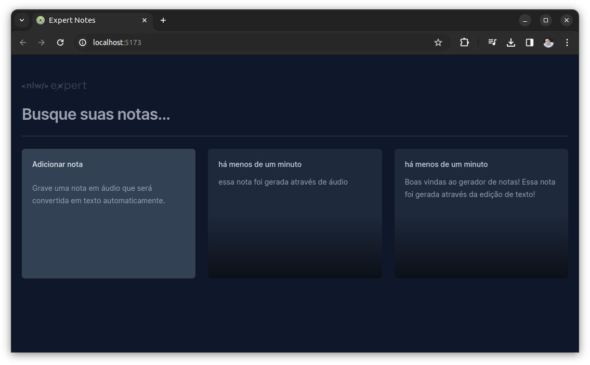

<h1 align="center">
  
</h1>

  <a href="#technologist-tecnologias">Tecnologias</a>&nbsp;&nbsp;&nbsp;|&nbsp;&nbsp;&nbsp;
  <a href="#-projeto">Projeto</a>&nbsp;&nbsp;&nbsp;|&nbsp;&nbsp;&nbsp;
  <a href="#-como-executar">Como executar</a>&nbsp;&nbsp;&nbsp;|&nbsp;&nbsp;&nbsp;
  <a href="#-licença">Licença</a>

  
  
  

  

## :technologist: Tecnologias

Este projeto faz uso das seguintes tecnologias:
- [React](https://reactjs.org)
- [TypeScript](https://www.typescriptlang.org/)
- [Vite](https://vitejs.dev/)
- [Radix](https://www.radix-ui.com/).
- [Tailwindcss](https://tailwindcss.com/).

## 💻 Projeto

O Expert Notes é uma aplicação web que permite o usuário criar pequenos cartões de notas, através de texto digitado ou reconhecimento de voz.
Desenvolvido durante o Next Level Week Expert da Rocketseat.

## 🚀 Como executar

- Clone o repositório
- Instale as dependências com `npm install` (node 20.11.0)
- Inicie o servidor com `npm run dev`

O servidor deverá iniciar no endereço: [http://localhost:5173/](http://localhost:5173/)

## 📄 Licença

Acesse [LICENSE](LICENSE.md) para mais informações sobre a licença.

## ♥ Agradecimento

A toda a equipe da Rocketseat por mostrar os caminhos para o próximo nível!